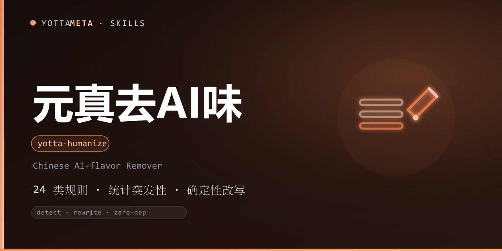

<p align="center"><b>Language</b>: English · <a href="./README.zh-CN.md">中文</a></p>

<p align="center">
  
</p>

<h1 align="center">yotta-humanize · 元真 (Yuanzhen)</h1>

<p align="center">YottaMeta's AI-flavor remover for Chinese writing: a <b>detector engine (24 rule classes + wordlists + statistical burstiness)</b> that identifies AI-typical text and applies <b>deterministic rewrites</b> to make Chinese copy read more naturally, more like a human wrote it. Use it to edit / polish text or to detect and rewrite AI-generated Chinese drafts.</p>
<p align="center">Activates when it detects AI-flavor patterns — empty uplift, clichés, AI jargon (赋能 / 闭环 / 抓手), synonym stacking, triple parallel constructions, chat residue (希望对你有所帮助) — <b>deterministic verdicts by rules, not prompt-engineering luck</b>.</p>
<p align="center">Pure Python 3.8+ standard library, zero external dependencies; Windows + Linux + macOS; detection + rewriting in one flow, rewriting does not depend on any model.</p>

<p align="center">
  <a href="LICENSE"></a>
  <a href="https://agentskills.io/"></a>
  <a href="https://www.npmjs.com/package/@yottameta/yotta-humanize"></a>
  <a href="https://github.com/YottaMeta/yotta-humanize"></a>
  <a href="https://github.com/YottaMeta/yotta-humanize/commits/main"></a>
  <a href="https://github.com/YottaMeta/yotta-humanize"></a>
</p>

## What it is

AI-generated Chinese text has a recognizable "AI flavor": empty uplift (标志着 / 彰显了), clichés (众所周知 / 综上所述 / 未来可期), jargon (赋能 / 闭环 / 抓手 / 颗粒度), mechanical enumeration (首先 / 其次 / 再次), chat residue (希望对你有所帮助)… Yuanzhen packages these signals into a **deterministic detector engine**: 24 rule classes (wordlists + sentence-pattern regexes) plus Chinese statistical burstiness (sentence-length uniformity / vocabulary diversity), outputting a 0-100 AI-flavor score and **deterministic rewrites** (wordlist substitution, cliché removal, chat-residue cleanup, punctuation throttling).

It is not tied to any single platform: an agent-agnostic toolkit that works in any agent supporting Agent Skills. Fully zero-dependency, no model calls; rewrites that need judgment are given as suggestions rather than forced automatically.

## Core value

- **24 detection rule classes** — content (empty uplift / cliché openers-closers / vague attribution / absolutism), language (AI jargon / synonym stacking / noun pile-ups / "we" overuse), sentence style (triple parallel / mechanical enumeration / rhetorical-question piles / punctuation abuse), communication (chat residue / flattery / disclaimer avoidance), filler (padding / transitions / repeated statements).
- **Statistical burstiness** — sentence-length uniformity (CV), burstiness, two-character vocabulary diversity (TTR), comma density — catches rhythm problems rules cannot see.
- **Deterministic rewriting** — unambiguous mechanical transforms are applied directly (赋能→支持, 抓手→切入点, 众所周知 / 综上所述 deleted, 希望对你有所帮助 cleaned, dash / exclamation throttled), outputting a fix list and before/after scores.
- **Machine readable** — --json outputs pure JSON; score --gate plugs into CI / pre-release checks.
- **Chinese-first** — wordlists, sentence patterns and rewrite mappings are all curated for Chinese text; no shared code with English humanizer-style skills.

## Why use it

| Advantage | Description |
|---|---|
| **Zero dependency** | Python 3.8+ standard library; no model / database / external service; Windows + Linux + macOS |
| **Deterministic** | Verdicts are reproducible and explainable; rewrites are deterministic transforms, not model probability |
| **Chinese-first** | Wordlists and patterns for Chinese AI-flavor (jargon / clichés / parallelism / chat residue) curated from scratch, not translated English rules |
| **Detect + rewrite in one** | score / analyze / report / suggest / rewrite — one command from detection to rewriting |
| **Reviewable** | Rewrites output a fix list and before/after scores so humans can verify item by item |
| **Ecosystem distribution** | GitHub + npm + ClawHub synced; four install methods (npx / git clone / Download ZIP / install.sh) |

## Commands

| Command | Description |
|---|---|
| score | AI-flavor score (0-100); --gate makes a CI gate (exit code 1) |
| analyze | Detailed detection report (text / --json) with matched rules, context snippets, suggestions |
| report | Markdown detection report (statistics table + matched rules) |
| suggest | Rewrite suggestions grouped by priority |
| rewrite | Deterministic rewrite: replace / remove AI-flavor, output fix list + rewritten text + before/after scores |
| version | Print the version |

## Quick start

Windows uses python, Linux/macOS uses python3.

```bash
# Score (0-100, higher = more AI-like)
python3 scripts/yotta_humanize.py score -f article.md

# Detailed detection report
python3 scripts/yotta_humanize.py analyze -f article.md

# Markdown report
python3 scripts/yotta_humanize.py report -f article.md > report.md

# Rewrite suggestions grouped by priority
python3 scripts/yotta_humanize.py suggest -f article.md

# Deterministic rewrite (outputs rewritten text + fix list)
python3 scripts/yotta_humanize.py rewrite -f article.md

# Pipe input
cat article.md | python3 scripts/yotta_humanize.py score --stdin

# CI gate: exit code 1 when score >= threshold
python3 scripts/yotta_humanize.py score -f article.md --gate --threshold 45
```

Exit codes (same semantics as the YuanAn / YuanShen / Yuandun family): **0** = success; **1** = score --gate and threshold reached; **4** = usage error / fatal exception.

## Install

Pick any of the four methods below; the order is the recommended priority. Skill files always come from **npm** (GitHub can be slow without a proxy; npm supports mirrors).

### Method 1: npm one-liner (recommended)

```text
# Optional China mirror: npm config set registry https://registry.npmmirror.com
npx -y @yottameta/yotta-humanize --agent <agent-name>      # install to the agent's default user-level skills dir
npx -y @yottameta/yotta-humanize --dir <your-skills-dir>   # point to the skills dir itself (e.g. ~/.codex/skills)
```

- `--agent <name>` installs to that agent's default user-level directory; `--list` shows each agent's default directory.
- `--dir <path>` installs to the given directory; for agents not in the preset list, point `--dir` at their skills directory.
- If the mirror has not synced the new package (404): add `--registry=https://registry.npmjs.org/` (a proxy may be needed in China), or wait for the mirror cache.

### Method 2: git clone (developers / git available)

```text
git clone https://github.com/YottaMeta/yotta-humanize.git <your-skills-dir>/yotta-humanize
```

### Method 3: GitHub Download ZIP (manual / no git)

On the GitHub repository `YottaMeta/yotta-humanize`, click **Code → Download ZIP**, unzip it and put the `yotta-humanize` folder into the agent's skills directory.

### Method 4: install.sh (multi-agent one-liner script)

```text
bash install.sh --agent <name>   # install to the agent's default user-level directory
bash install.sh --dir <path>     # install to the given directory
bash install.sh --list           # list agents -> default directories
```

> Method 1 uses the npm registry (npmmirror / npmjs) and does not depend on GitHub; Methods 2/3 use GitHub and may fail without a proxy in China.
## Usage examples (AI agent)

1. Hook this repo's SKILL.md into any AI agent's skill/rule system (see install above).
2. When you receive a heavily AI-flavored draft, run a detection first:
   ```bash
   python3 scripts/yotta_humanize.py analyze -f draft.md
   ```
   Check the score and matched rules (empty uplift / jargon / clichés / chat residue, etc.).
3. Apply direct mechanical rewrites for the unambiguous parts:
   ```bash
   python3 scripts/yotta_humanize.py rewrite -f draft.md
   ```
   Review against the fix list and write the rewritten text back into the draft.
4. For parts that need judgment (splitting parallel constructions, adding sources for vague attribution, softening absolutism), polish by hand following the suggest output.
5. After rewriting, score once more to confirm the score dropped and the original meaning is intact.

## Boundaries

- **Text-only, no generation** — it edits existing text; it does not create new content, and it does not alter facts / data / proper nouns against the author's intent.
- **Rewrites are suggestions** — unambiguous transforms apply directly; judgment-heavy rewrites are listed as suggestions for the human to confirm.
- **No model dependency** — deterministic rules only; results are reproducible and explainable.

## Before / after

**Input** (typical AI-flavored Chinese):

```text
赋能业务增长，打造闭环生态，提升用户体验，实现价值最大化。
```

**Output** (deterministic `rewrite`, illustrative):

```text
帮业务更快增长，把流程走通，让用户用得顺手，做出实实在在的价值。
```

Score before 68/100 → after 23/100; `rewrite` also prints a fix list (what changed and how many times).

## Errors

- Exit codes: **0** success; **1** `--gate` hit (CI block); **4** input error (missing file, no input).
- Missing file / non-UTF-8 encoding / permission errors show a **Chinese fix suggestion** instead of a raw English stack trace.
- FAQ and pitfalls: [references/faq.md](references/faq.md).

## FAQ (quick reference)

| Question | Answer (see references/faq.md) |
|---|---|
| How to pass text? | `-f file` / `--stdin` / positional text |
| File not UTF-8? | Re-save as UTF-8 and retry |
| Long text? | Process in segments; nested cases may need human review |
| Small change after rewrite? | Low AI flavor; run analyze to see hits, suggest for polish |
| rewrite vs suggest? | rewrite applies mechanically; suggest gives manual-polish advice |
| CI gate? | `--gate --threshold 40`, exit 1 on hit |
| Will it corrupt my text? | Deterministic replacements + fix list + before/after score |

## Development & validation

- Tests: python scripts/test_yotta_humanize.py (155 tests; Windows: python)
- Base validation: python tools/validate-skill.py yotta-humanize (run at the repo root)
- Rule catalog: references/patterns.md; scoring formula: references/scoring.md; rewriting rules: references/rewriting.md

Keep tests green and bump the version before releasing changes.

## Changelog

See [CHANGELOG.md](./CHANGELOG.md).

## License

[MIT](./LICENSE) © YottaMeta. "Yuanzhen" / "yotta-humanize" and the YottaMeta family names (yotta-* prefix) are YottaMeta brand identifiers; derived works must not reuse them, see [NOTICE](./NOTICE). The de-AI-flavor direction references open-source humanizer-style skills; the implementation is YottaMeta's own Chinese-corpus code.
